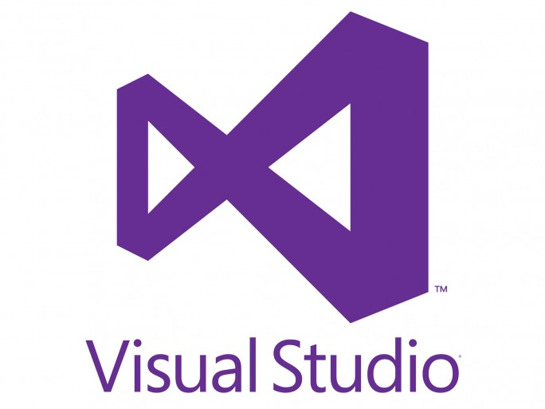

# Présentation
Ceci est le github pour le projet Huffman en C et en introduction au Génie Logiciel.
 
Nous sommes le groupe n°7 composé de : 
Noé Lefèvre
Michaël Sok
Eric Wang
Arthur Gobilliard
 

Ce projet est en lien avec le codage Huffman : https://docs.google.com/document/d/1OUURID_qB3oDBcD7CSMamJLHXSZrWsKi3olc_nWZEvU/edit

# Fonctionnement

Ce projet a été conçu sous CodeBlocks et Visual Studio 
 
 

 
 
Le programme a été lancé **UNIQUEMENT SOUS WINDOWS**, les configurations sont les suivantes :  
| Configuration requise  | Minimal | Recommandé |  
|------------------------|---------|------------|
| Système d'exploitation nécessaire ! Windows 7 x64 | Windows 10 x64 |
| Processeur | Intel Core Duo ou mieux | Intel Core I5 ou mieux |
| Mémoire vive | 512 Mo de mémoire | 8 Go de mémoire |
| Espace requis | 10 Mo requis |10 Mo requis |

| Architecture | Master | Stable | Installer |
|--------------|--------|--------|-----------|
| x64 |  |  |  | 
