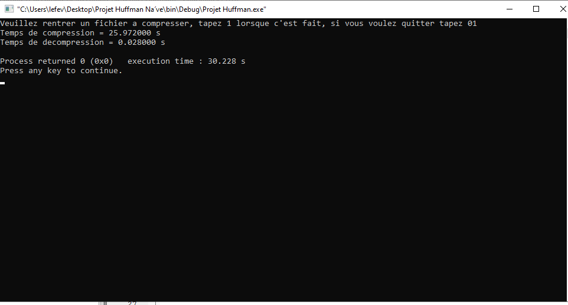
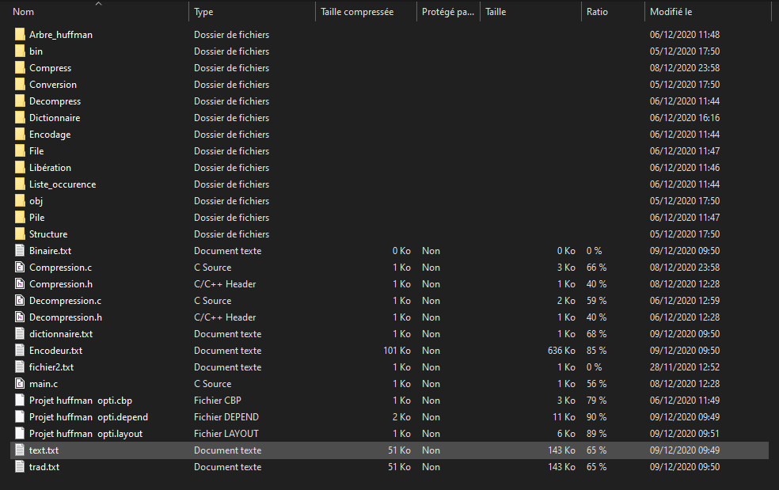
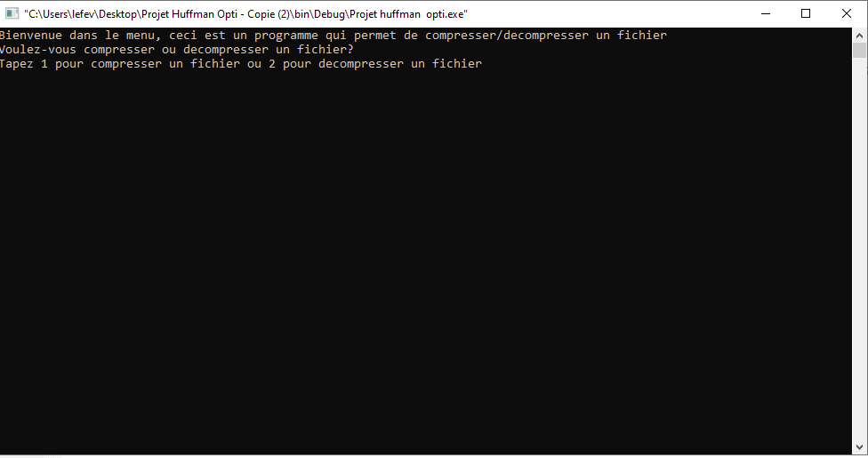
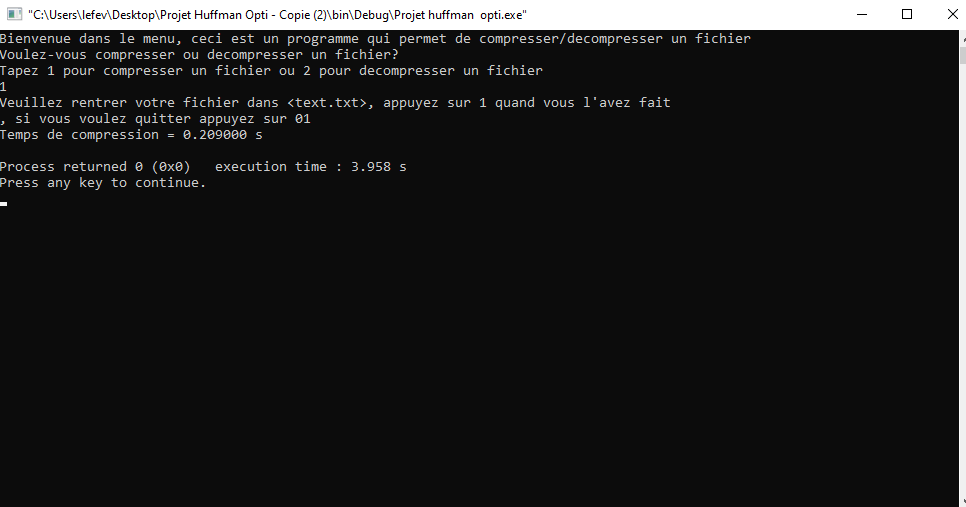
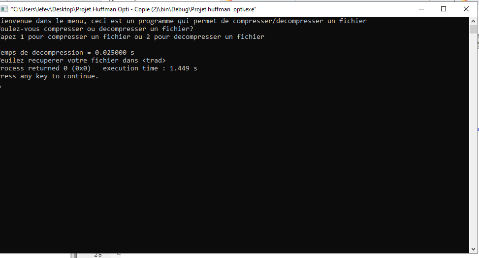

# Présentation
Ceci est le github pour le projet Huffman en C et en introduction au Génie Logiciel.
 
Nous sommes le groupe n°7 composé de : 
Noé Lefèvre
Michaël Sok
Eric Wang
Arthur Gobilliard
 

Ce projet est en lien avec le codage Huffman : https://docs.google.com/document/d/1OUURID_qB3oDBcD7CSMamJLHXSZrWsKi3olc_nWZEvU/edit

# Fonctionnement

Ce projet a été conçu sous CodeBlocks et Visual Studio 
 
 

 
 
Le programme a été lancé **UNIQUEMENT SOUS WINDOWS**, les configurations sont les suivantes :  
| Configuration requise  | Minimal | Recommandé |  
|------------------------|---------|------------|
| Système d'exploitation nécessaire | Windows 7 x64 | Windows 10 x64 |
| Processeur | Intel Core Duo ou mieux | Intel Core I5 ou mieux |
| Mémoire vive | 512 Mo de mémoire | 8 Go de mémoire |
| Espace requis | 10 Mo requis |10 Mo requis |

# Logiciel

## Partie naïve

La partie naïve permet de compresser et décompresser un fichier texte. Cela prend environ 30 sec à compresser **ATTENTION : il faut d'abord compresser le fichier avant de pouvoir le décompresser**

Sortie console :   

## Partie optimisée

La partie optimisée permet de compresser ou de décompresser un fichier texte. Ici l'Utilisateur peut décompresser le fichier sans à avoir à passer par la compression.
Pour cela il faut qu'il modifie le fichier text.txt dans le dossier Projet_Huffman_Opti :   

 
L'utilisateur sera accueill par une interface simple, il peut appuyer sur <kbd>1</kbd> pour compresser, ou <kbd>2</kbd> pour décompresser : 
  

### Compression
Pour la compression, lorsque le fichier texte est rempli, il faut appuyer sur <kbd>1</kbd> :   

 
### Décompression
Pour la décompression on a :   

 

# Autres
Si il y a un problème lors du lancement du programme, veuillez envoyer un mail à : **noe.lefevre@efrei.net**

